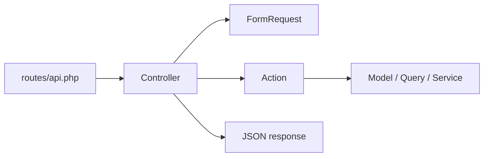

# Backend Architecture Guide

Este backend vai seguir uma organizacao simples e repetivel.
O objetivo e deixar cada nova feature previsivel, sem espalhar regra de negocio em controller e sem criar pastas genericas demais.

## Fluxo padrao da API

Toda feature HTTP deve seguir este fluxo:

`route -> controller -> request -> action -> model/service -> response`



Leitura rapida:

- `Controller` recebe a chamada e coordena o fluxo.
- `Request` valida e autoriza a entrada.
- `Action` executa o caso de uso.
- `Service` entra apenas quando houver integracao externa ou logica tecnica reaproveitada.

## Arvore que vamos seguir

```text
app/
  Actions/
    Auth/
      LoginUser.php
      RegisterUser.php
    River/
      CreateRiver.php
      UpdateRiver.php
  Http/
    Controllers/
      Auth/
        AuthController.php
      River/
        RiverController.php
    Requests/
      Auth/
        LoginRequest.php
        RegisterRequest.php
      River/
        StoreRiverRequest.php
        UpdateRiverRequest.php
  Models/
    User.php

tests/
  Feature/
    Auth/
      LoginTest.php
      RegisterTest.php
    River/
      CreateRiverTest.php
      UpdateRiverTest.php
  Unit/
    Services/
      GeocodingServiceTest.php
```

Observacao:

- `Requests`, `Actions` e `tests` ja estao caminhando nesse formato.
- A partir de agora, novos `Controllers` tambem devem ser separados por contexto (`Auth`, `River`, `Event`, `Post`).
- Controllers antigos podem ser movidos quando forem tocados em refactor, sem pressa.

## Responsabilidade de cada camada

### Controllers

Ficam em `app/Http/Controllers/{Contexto}`.

Devem:

- receber o `Request`
- chamar uma `Action` ou, em casos especificos, um `Service`
- devolver a resposta HTTP/JSON

Nao devem:

- concentrar regra de negocio
- validar campo manualmente
- montar query complexa direto no metodo

### Requests

Ficam em `app/Http/Requests/{Contexto}`.

Devem concentrar:

- `authorize()`
- `rules()`
- validacao da entrada daquele endpoint

Regra pratica:

- se a validacao muda, crie um novo `Request`
- no controller, prefira sempre trabalhar com `$request->validated()`

### Actions

Ficam em `app/Actions/{Contexto}`.

Papel:

- representar um caso de uso claro do sistema
- ter uma responsabilidade principal
- expor um metodo publico padrao: `execute()`

Exemplos de ideia:

- `RegisterUser`
- `CreateRiver`
- `UpdateEvent`

Regra pratica:

- se a classe responde "o que o sistema faz", ela tende a ser `Action`

### Services

So devem existir quando fizer sentido criar `app/Services/...`.

Use `Service` quando a classe representar:

- integracao externa
- regra tecnica compartilhada por mais de uma `Action`
- orquestracao que nao pertence a um unico endpoint

Exemplos de ideia:

- `GeocodingService`
- `MediaStorageService`

Regra pratica:

- se a classe responde "como algo tecnico acontece", ela tende a ser `Service`
- se ela existe so para um caso de uso, prefira `Action`

### Tests

Ficam em `tests/Feature/{Contexto}` e `tests/Unit/...`.

Padrao inicial:

- `Feature` para testar comportamento da API
- `Unit` apenas quando houver regra isolada o suficiente para valer teste unitario

Regra pratica:

- endpoint novo pede pelo menos um teste de `Feature`
- regra tecnica isolada pode ganhar teste de `Unit`

## Naming rules

### Pastas

- organizar por contexto de negocio
- exemplos: `Auth`, `River`, `Event`, `Post`

### Controllers

- nome em `PascalCase`
- sufixo `Controller`
- exemplos: `AuthController`, `RiverController`

Metodos:

- CRUD: `index`, `show`, `store`, `update`, `destroy`
- fluxos fora de CRUD: `login`, `register`, `logout`

### Requests

- nome em `PascalCase`
- sufixo `Request`
- preferir verbo + recurso quando for CRUD
- exemplos: `StoreRiverRequest`, `UpdateRiverRequest`, `LoginRequest`

### Actions

- nome em `PascalCase`
- verbo + recurso
- manter sem sufixo `Action` por enquanto, porque o projeto ja comecou assim
- exemplos: `LoginUser`, `RegisterUser`, `CreateRiver`

Se no futuro quiser usar sufixo `Action`, a troca deve ser global para nao misturar estilos.

### Services

- nome em `PascalCase`
- capacidade tecnica + sufixo `Service`
- exemplos: `GeocodingService`, `ImageUploadService`

### Tests

- arquivo termina com `Test`
- nome reflete o comportamento testado
- exemplos: `LoginTest`, `RegisterTest`, `CreateRiverTest`

Metodos de teste:

- `test_user_can_create_river`
- `test_guest_cannot_create_river`
- `test_create_river_requires_name`

### Rotas

- recursos em plural: `/rivers`, `/events`, `/posts`
- auth pode manter rotas orientadas a acao: `/login`, `/register`, `/logout`

### Resposta JSON

Padrao inicial para sucesso:

```json
{
  "message": "Texto curto",
  "data": {}
}
```

Isso ajuda o frontend a consumir respostas com menos surpresa.

## Checklist de nova feature

1. Criar a rota em `routes/api.php`.
2. Criar ou atualizar o controller do contexto.
3. Criar um `FormRequest` se houver validacao propria.
4. Criar uma `Action` para o caso de uso.
5. Escrever teste de `Feature` para o endpoint.
6. Criar `Service` apenas se houver necessidade tecnica real.

## O que evitar

- criar pastas genericas como `Helpers`, `Utils` ou `Misc`
- colocar regra de negocio no controller
- criar `Service` por reflexo quando uma `Action` resolve
- misturar estilos de nome no mesmo contexto

## Referencias oficiais

- [Laravel: Directory Structure](https://laravel.com/docs/12.x/structure)
- [Laravel: Controllers](https://laravel.com/docs/12.x/controllers)
- [Laravel: Validation / Form Requests](https://laravel.com/docs/12.x/validation#form-request-validation)
- [Laravel: HTTP Tests](https://laravel.com/docs/12.x/http-tests)
